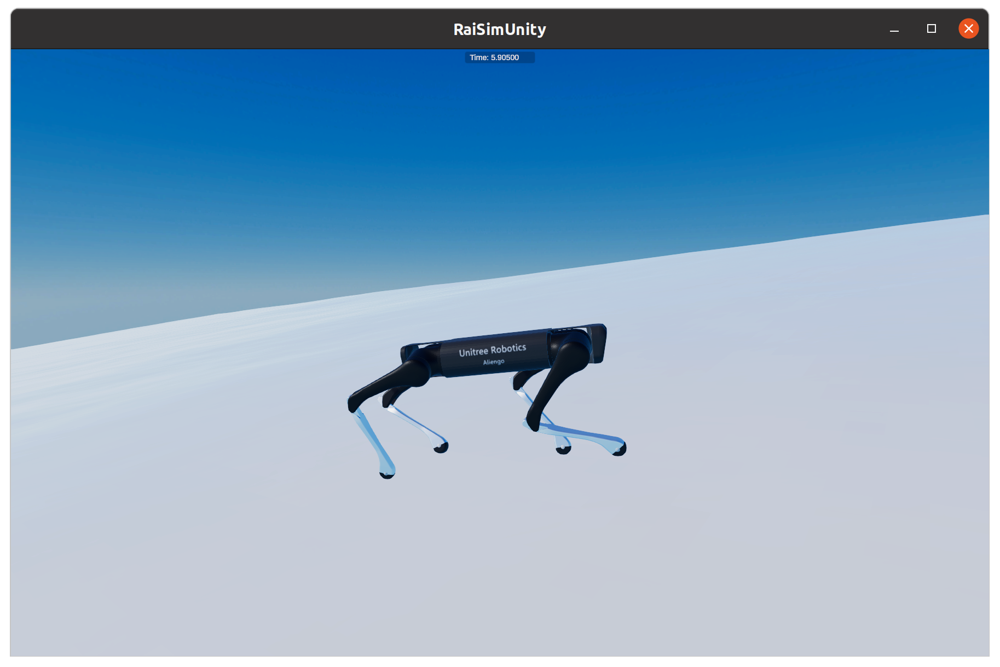
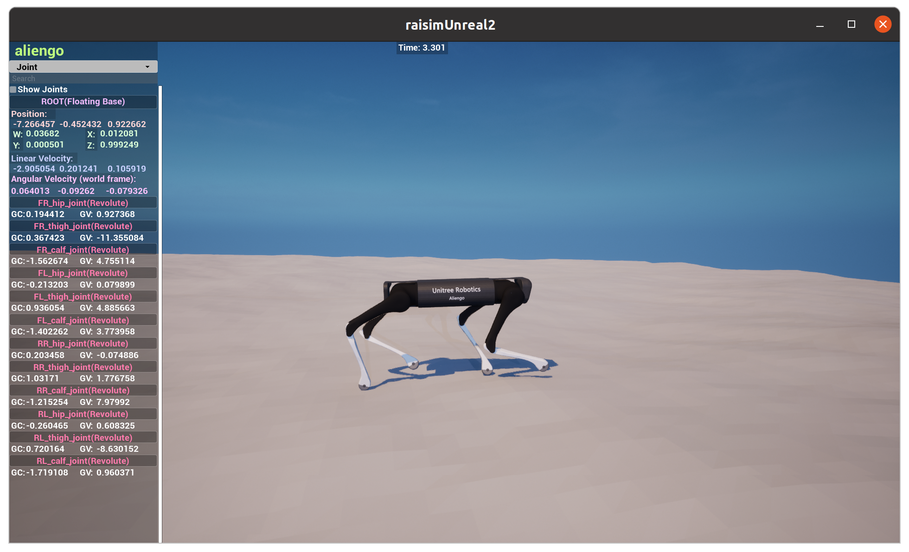

# Quadrupedal Velocity Tracking

This is the official repo for Learning Agile and Accurate Velocity Tracking for
Quadrupedal Robots. This contains a prebuilt version of our environment
and a pretrained model for playing.

## Dependencies

- OS: Only tested on Ubuntu 20.04 and 22.04
- [RaiSim @ 5f267d](https://github.com/raisimTech/raisimLib) (installed, RaiSimPy not needed)
- [Eigen3](https://eigen.tuxfamily.org/index.php?title=Main_Page)
- [yaml-cpp](https://github.com/jbeder/yaml-cpp)

To use raisim, you need to get a lisense from [raisim.com](https://raisim.com/sections/License.html) first.
For the last 2 dependencies, you may run:

```shell
sudo apt-get install libeigen3-dev libyaml-cpp-dev
```

Python 3.10 is used for this work. Install Python requirements:

```shell
pip install -r requirements.txt
```

## Play

Basic Usage:

```shell
PYTHONPATH=./ python rsg_envs/scripts/velocity_tracking/play.py \
    models/aliengo-velocity-tracking/demo 
```

[RaiSimUnity](https://raisim.com/sections/RaisimUnity.html) or 
[RaiSimUnreal](https://raisim.com/sections/RaisimUnreal.html) is required to visualize the simulation.
<p align="middle">
  
   
</p>
